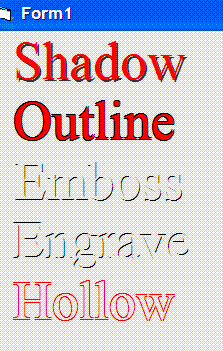



## shadow outline emboss engrave

### Description

How the simple text effects - shadow outline emboss engrave - are drawn.
 
### More Info
 

             |
---                |---
**Submitted On**   |2008-11-07 01:10:02
**By**             |[Kenneth Buckmaster](https://github.com/Planet-Source-Code/PSCIndex/blob/master/ByAuthor/kenneth-buckmaster.md)
**Level**          |Beginner
**User Rating**    |4.9 (59 globes from 12 users)
**Compatibility**  |VB 6\.0
**Category**       |[Graphics](https://github.com/Planet-Source-Code/PSCIndex/blob/master/ByCategory/graphics__1-46.md)
**World**          |[Visual Basic](https://github.com/Planet-Source-Code/PSCIndex/blob/master/ByWorld/visual-basic.md)
**Archive File**   |[shadow\_out2133321172008\.zip](https://github.com/Planet-Source-Code/kenneth-buckmaster-shadow-outline-emboss-engrave__1-71363/archive/master.zip)

